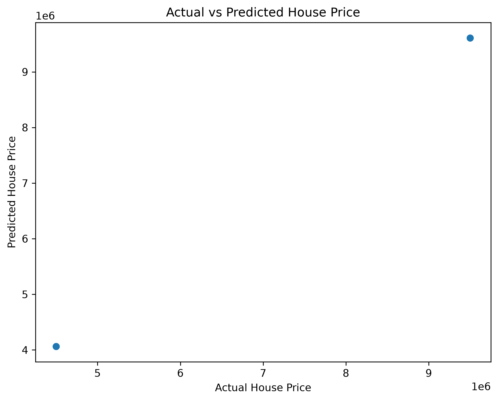

# 🏠 House Price Prediction

## 📌 Project Overview

This project predicts house prices using Machine Learning. A Linear Regression model is trained on housing data to estimate house prices based on different features.

---

## 🎯 Objective

- Predict house prices using Machine Learning.
- Analyze housing data.
- Evaluate model performance.
- Visualize prediction results.

---

## 🛠 Technologies Used

- Python
- Pandas
- Matplotlib
- Scikit-learn

---

## 📂 Dataset

Dataset File:

- house_data.csv

---

## 🤖 Machine Learning Model

- Linear Regression

---

## 📈 Model Performance

- Mean Absolute Error (MAE)
- R² Score

---

## 📸 Project Screenshots

### Actual vs Predicted House Price



---

## 🚀 How to Run

```bash
pip install -r requirements.txt
python house_price_prediction.py
```

---

## 📁 Project Structure

```
House_Price_Prediction/
│
├── house_price_prediction.py
├── house_data.csv
├── README.md
├── requirements.txt
├── .gitignore
├── LICENSE
└── IMAGES/
    └── actual_vs_predicted.png
```

---

## 👩‍💻 Author

**Bristi Ray**

GitHub: https://github.com/BristiV123